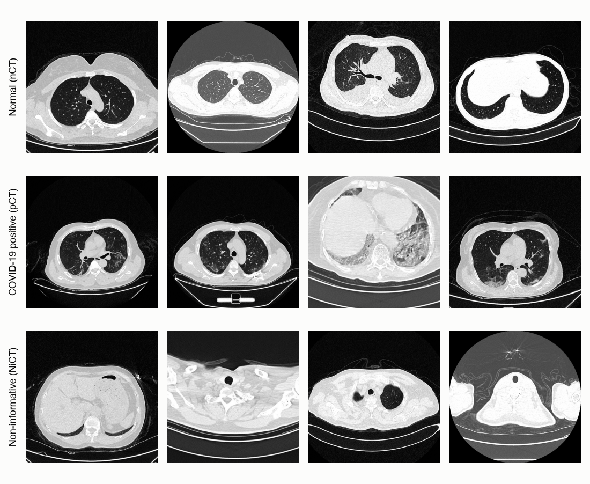
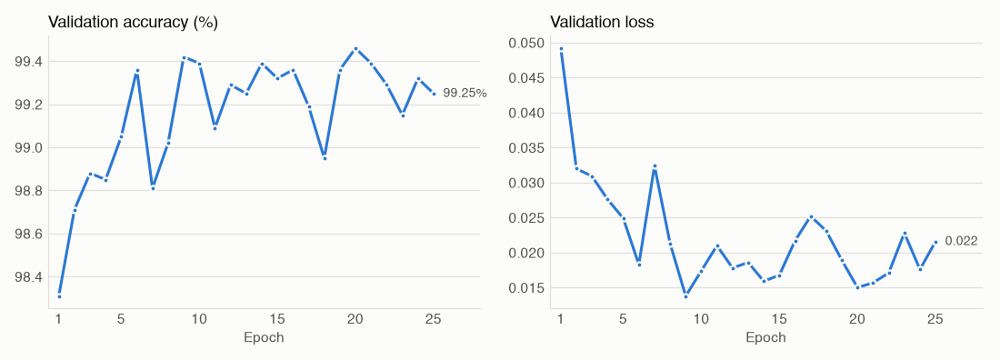
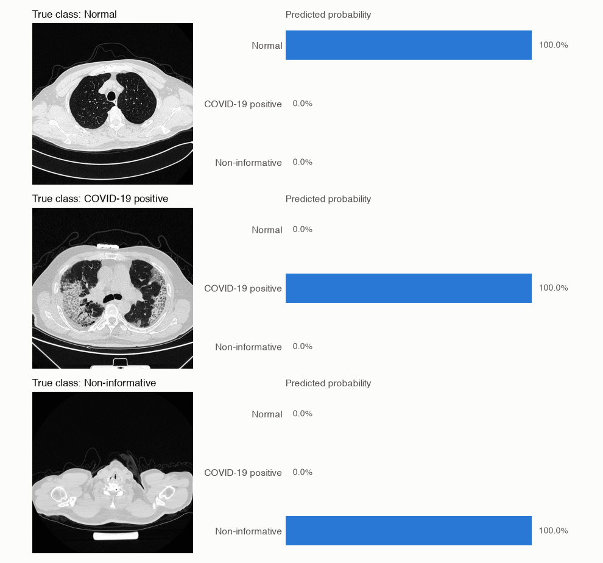
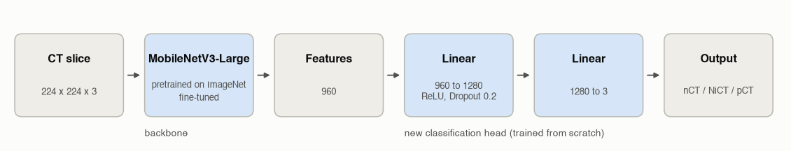

# COVID-19 CT Scan Classifier

A PyTorch image classifier that sorts chest CT slices into three classes: normal, COVID-19 positive and non-informative. It uses transfer learning on MobileNetV3-Large and reaches **99.76% accuracy** on a held-out test set of 2,956 slices.



The project started as a university assignment and was first trained on a Windows PC with an NVIDIA RTX 2060. This version has been ported to Apple Silicon and trains on the Mac's GPU through PyTorch's MPS backend.

> This is a learning project. It is not a medical device and must not be used to make decisions about anyone's health.

## The task

Every image is a single axial slice from a chest CT scan. The model assigns it to one of three classes:

| Class | Meaning | Images |
|---|---|---:|
| `nCT` | Normal. The lungs are visible and show no signs of COVID-19. | 9,979 |
| `pCT` | Positive. The lungs show changes typical of COVID-19 pneumonia. | 4,001 |
| `NiCT` | Non-informative. The slice does not show enough of the lungs to judge. | 5,705 |

The third class matters in practice. A CT scan contains many slices above and below the lungs, and a useful model has to recognise those instead of forcing them into "normal" or "positive".

## Results

| Split | Images | Accuracy | Loss |
|---|---:|---:|---:|
| Train | 13,778 | 98.70% | 0.0316 |
| Validation | 2,951 | 99.25% | 0.0216 |
| **Test** | **2,956** | **99.76%** | **0.0070** |



Validation accuracy passes 99% after five epochs and then moves between 98.8% and 99.5% for the rest of training, so most of the learning happens early. Training accuracy is slightly lower than validation and test accuracy because it is measured with the training augmentations (random crops and flips) still switched on.

The Mac run reproduces the original Windows run closely:

| | Original (RTX 2060, CUDA) | This version (M5 Pro, MPS) |
|---|---:|---:|
| Train accuracy | 98.58% | 98.70% |
| Validation accuracy | 99.42% | 99.25% |
| Test accuracy | 99.53% | 99.76% |
| Training time, 25 epochs | not recorded | 41 min |

Predictions of the trained model on one test slice per class:



## How it works

### Data

The dataset is split per class into roughly 70% training, 15% validation and 15% test images. The split uses a fixed seed (42) and fixed counts per class, so it is identical on every run. All images are resized and normalised with the ImageNet statistics that the pretrained network expects. Training images additionally get random resized crops and horizontal flips.

### Model



The backbone is [MobileNetV3-Large](https://arxiv.org/abs/1905.02244), a compact convolutional network designed for mobile devices and pretrained on ImageNet. It turns each 224 x 224 image into a vector of 960 features. Its original 1,000-class head is replaced by a small classifier with one hidden layer of 1,280 units, ReLU, 20% dropout and three outputs. The whole network is fine-tuned, not just the new head, which adds up to 4.2 million trainable parameters.

### Training

| Setting | Value |
|---|---|
| Loss | Negative log-likelihood on log-softmax outputs (equivalent to cross-entropy) |
| Optimizer | AdamW, learning rate 1e-4, weight decay 1e-4 |
| Batch size | 16 |
| Epochs | 25 |
| Precision | float32 |
| Hardware | MacBook Pro M5 Pro, 48 GB, PyTorch MPS backend |

Mixed precision is supported on MPS but was slower than float32 for this model in my tests, so it is switched off.

## Getting started

### Requirements

- Python 3.11
- macOS with Apple Silicon for GPU training. Other systems fall back to the CPU, which works but is much slower.
- About 4 GB of disk space for the dataset

### Setup

```bash
git clone https://github.com/chrispathway/covid-ct-classifier.git
cd covid-ct-classifier

python3.11 -m venv .venv
source .venv/bin/activate
pip install -r requirements.txt
```

### Getting the data

The images come from Kaggle. Create an API token under Kaggle > Settings > API > Create New Token, then:

```bash
mkdir -p ~/.kaggle && mv ~/Downloads/kaggle.json ~/.kaggle/ && chmod 600 ~/.kaggle/kaggle.json
kaggle datasets download -d azaemon/preprocessed-ct-scans-for-covid19 -p ~/datasets/covid-ct --unzip
```

The download contains original and preprocessed slices. This project uses the original ones. Copy their `nCT`, `NiCT` and `pCT` folders into a folder called `CT Scans` in the project root:

```
CT Scans/
├── nCT/
├── NiCT/
└── pCT/
```

### Training

Open `classifier.ipynb` in Jupyter or VS Code and run all cells. The notebook checks the image counts, trains for 25 epochs, evaluates all three splits and saves the model to `outputs/checkpoints/mobilenet_v3_large.pth`. Setting `SMOKE_TEST = True` in the settings cell runs a single epoch, which is useful for checking the setup first.

### Using the trained model

The trained weights are included in the repository, so you can classify images without training:

```python
import torch
from torch import nn
from torchvision import models, transforms
from PIL import Image

ckpt = torch.load("outputs/checkpoints/mobilenet_v3_large.pth", map_location="cpu")

class Head(nn.Module):
    def __init__(self):
        super().__init__()
        self.net = nn.Sequential(nn.Linear(960, 1280), nn.ReLU(), nn.Dropout(0.2), nn.Linear(1280, 3))

    def forward(self, x):
        return self.net(x)

model = models.mobilenet_v3_large(weights=None)
model.classifier = Head()
model.load_state_dict(ckpt["state_dict"])
model.eval()

preprocess = transforms.Compose([
    transforms.Resize(256),
    transforms.CenterCrop(224),
    transforms.ToTensor(),
    transforms.Normalize([0.485, 0.456, 0.406], [0.229, 0.224, 0.225]),
])

image = preprocess(Image.open("path/to/slice.jpg").convert("RGB")).unsqueeze(0)
with torch.no_grad():
    probs = torch.softmax(model(image), dim=1)[0]

for name, idx in ckpt["class_to_idx"].items():
    print(f"{name}: {probs[idx]:.1%}")
```

## Repository structure

```
.
├── classifier.ipynb                         Notebook: data, training, evaluation, inference
├── classifier.html                          Static export of the notebook with all outputs
├── outputs/checkpoints/
│   └── mobilenet_v3_large.pth               Trained model (17 MB)
├── assets/                                  Images used in this README
├── requirements.txt
└── README.md
```

## Limitations

- **The split is per slice, not per patient.** The dataset contains many slices from each patient, and neighbouring slices look very similar. Slices from the same person can appear in both the training and the test set, so the test accuracy is likely higher than it would be on new patients.
- **Limited data sources.** All scans come from two hospitals in Wuhan. Images from other scanners, protocols or populations may look different, and the model has not been evaluated on them.
- **Single slices only.** The model judges one slice at a time. A clinical assessment considers the full scan together with symptoms and lab results.

## Acknowledgements

- Dataset: [CT Scans for COVID-19 Classification](https://www.kaggle.com/datasets/azaemon/preprocessed-ct-scans-for-covid19) by Abu Zahid Bin Aziz, licensed under CC BY 4.0. The original images are from the [iCTCF](http://ictcf.biocuckoo.cn/) resource: Ning, W. et al., "iCTCF: an integrative resource of chest computed tomography images and clinical features of patients with COVID-19 pneumonia" (2020).
- Model: Howard, A. et al., ["Searching for MobileNetV3"](https://arxiv.org/abs/1905.02244), ICCV 2019. Pretrained weights from [torchvision](https://pytorch.org/vision/stable/models/mobilenetv3.html).
